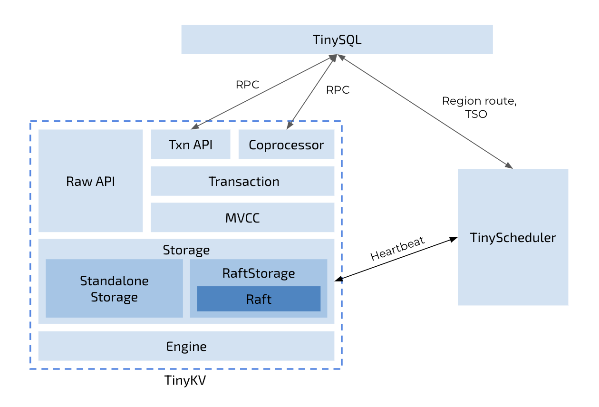

# The TinyKV Course

The TinyKV course builds a key-value storage system with the Raft consensus algorithm. It is inspired by [MIT 6.824](https://pdos.csail.mit.edu/6.824/) and [TiKV Project](https://github.com/tikv/tikv).

After completing this course, you will have the knowledge to implement a horizontally scalable, highly available, key-value storage service with distributed transaction support. Also, you will have a better understanding of TiKV architecture and implementation.

## Course Architecture

The whole project is a skeleton code for a key-value server and a scheduler server at the beginning - you need to finish the core logic step by step:

* [Standalone KV](doc/project1-StandaloneKV.md)
  * Implement a standalone storage engine.
  * Implement raw key-value service handlers.
* [Raft KV](doc/project2-RaftKV.md)
  * Implement the basic Raft algorithm
  * Build a fault-tolerant KV server on top of Raft
  * Add the support of Raft log garbage collection and snapshot
* [Multi-raft KV](doc/project3-MultiRaftKV.md)
  * Implement membership change and leadership change to Raft algorithm.
  * Implement conf change and region split on Raft store
  * Implement a basic scheduler.
* [Transaction](doc/project4-Transaction.md)
  * Implement the multi-version concurrency control layer.
  * Implement handlers of `KvGet`, `KvPrewrite`, and `KvCommit` requests.
  * Implement handlers of `KvScan`, `KvCheckTxnStatus`, `KvBatchRollback`, and `KvResolveLock` requests.

## Code Structure



Similar to the architecture of TiDB + TiKV + PD that separates the storage and computation, TinyKV only focuses on the storage layer of a distributed database system. If you are also interested in the SQL layer, please see [TinySQL](https://github.com/tidb-incubator/tinysql). Besides that, there is a component called TinyScheduler acting as a center control of the whole TinyKV cluster, which collects information from the heartbeats of TinyKV. After that, the TinyScheduler can generate scheduling tasks and distribute the tasks to the TinyKV instances. All of instances are communicated via RPC.

The whole project is organized into the following directories:

* `kv` contains the implementation of the key-value store.
* `raft` contains the implementation of the Raft consensus algorithm.
* `scheduler` contains the implementation of the TinyScheduler, which is responsible for managing TinyKV nodes and generating timestamps.
* `proto` contains the implementation of all communication between nodes and processes uses Protocol Buffers over gRPC. This package contains the protocol definitions used by TinyKV, and the generated Go code that you can use.
* `log` contains utility to output log based on level.

## Build TinyKV from Source

### Prerequisites

* `git`: The source code of TinyKV is hosted on GitHub as a git repository. To work with git repository, please [install `git`](https://git-scm.com/downloads).
* `go`: TinyKV is a Go project. To build TinyKV from source, please [install `go`](https://golang.org/doc/install) with version greater or equal to 1.13.

## Setup GOPATH

If `echo $GOPATH` gives empty result, you should set up `GOPATH` firstly.

```bash
export GOPATH=$(go env GOPATH)
```

## Clone

Clone the source code to your development machine.

```bash
mkdir -p $GOPATH/src/github.com/tidb-incubator
cd $GOPATH/src/github.com/tidb-incubator
git clone https://github.com/tidb-incubator/tinykv.git
```

## Build

Build TiDB from the source code.

```bash
cd $GOPATH/src/github.com/tidb-incubator/tinykv
make
```

It builds the binary of `tinykv-server` and `tinyscheduler-server` to `bin` dir.

## Contributing

Any feedback and contribution is greatly appreciated. Please see [issues](https://github.com/tidb-incubator/tinykv/issues) if you want to join in the development.
