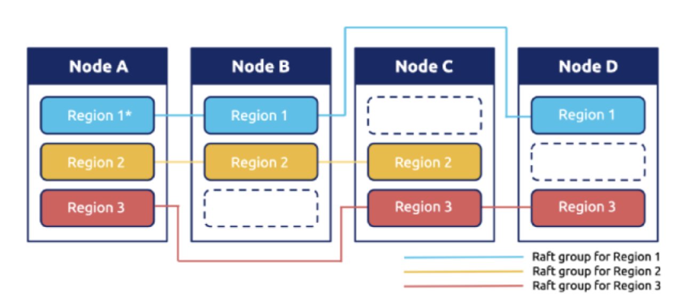
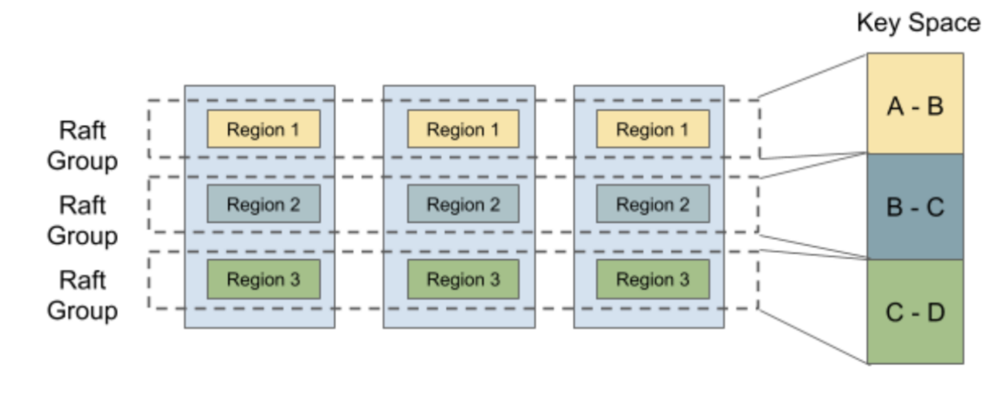
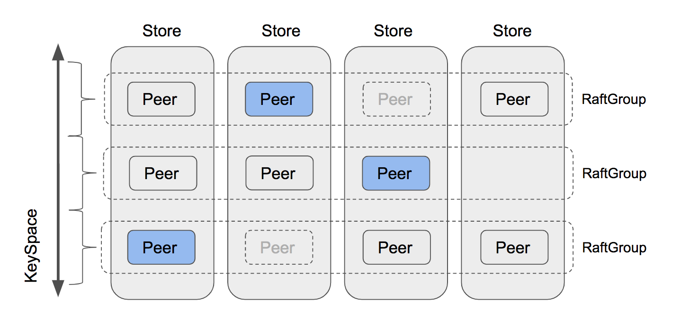

# Project3 MultiRaftKV

In project2, you have built a high available kv server based on Raft, good work! But not enough, such kv server is backed by a single raft group which is not unlimited scalable, and every write request will wait until committed and then write to badger one by one, which is a key requirement to ensure consistency, but also kill any concurrency.



In this project you will implement a multi raft-based kv server with balance scheduler, which consist of multiple raft groups, each raft group is responsible for a single key range which is named region here, the layout will be looked like the above diagram. Requests to a single region are handled just like before, yet multiple regions can handle requests concurrently which improves performance but also bring some new challenges like balancing the request to each region, etc.

This project has 3 part, including:

1. Implement membership change and leadership change to Raft algorithm
2. Implement conf change and region split on raftstore
3. Introduce scheduler

## Part A

In this part you will implement membership change and leadership change to the basic raft algorithm, these features are required by the next two parts. Membership change, namely conf change, is used to add or remove peers to the raft group, which can change the quorum of the raft group, so be careful. Leadership change, namely leader transfer, is used to transfer the leadership to another peer, which is very useful for balance.

### The Code

The code you need to modify is all about `raft/raft.go` and `raft/rawnode.go`, also see `proto/proto/eraft.proto` for new messages you need to handle. And both conf change and leader transfer are triggered by the upper application, so you may want to start at `raft/rawnode.go`.

### Implement leader transfer

To implement leader transfer, let’s introduce two new message types: `MsgTransferLeader` and `MsgTimeoutNow`. To transfer leadership you need to first call `raft.Raft.Step` with `MsgTransferLeader` message on the current leader, and to ensure the success of the transfer, the current leader should first check the qualification of the transferee (namely transfer target) like: is the transferee’s log up to date, etc. If the transferee is not qualified, the current leader can choose to abort the transfer or help the transferee, since abort is not helping, let’s choose to help the transferee. If the transferee’s log is not up to date, the current leader should send a `MsgAppend` message to the transferee and stop accepting new proposals in case we end up cycling. So if the transferee is qualified (or after the current leader’s help), the leader should send a `MsgTimeoutNow` message to the transferee immediately, and after receiving a `MsgTimeoutNow` message the transferee should start a new election immediately regardless of its election timeout, with a higher term and up to date log, the transferee has great chance to step down the current leader and become the new leader.

### Implement conf change

Conf change algorithm you will implement here is not the joint consensus algorithm mentioned in the extended Raft paper that can add and/or remove arbitrary peers at once, instead, it can only add or remove peers one by one, which is more simple and easy to reason about. Moreover, conf change start at calling leader’s `raft.RawNode.ProposeConfChange` which will propose an entry with `pb.Entry.EntryType` set to `EntryConfChange` and `pb.Entry.Data` set to the input `pb.ConfChange`. When entries with type `EntryConfChange` are committed, you must apply it through `RawNode.ApplyConfChange` with the `pb.ConfChange` in the entry, only then you can add or remove peer to this raft node through `raft.Raft.addNode` and `raft.Raft.removeNode` according to the `pb.ConfChange`.

> Hints:
>
> - `MsgTransferLeader` message is local message that not come from network
> - You set the `Message.from` of the `MsgTransferLeader` message to the transferee (namely transfer target)
> - To start a new election immediately you can call `Raft.Step` with `MsgHup` message
> - Call `pb.ConfChange.Marshal` to get bytes represent of `pb.ConfChange` and put it to `pb.Entry.Data`

## Part B

As the Raft module supported membership change and leadership change now, in this part you need to make TinyKV support these admin commands based on part A. As you can see in `proto/proto/raft_cmdpb.proto`, there are four types of admin commands:

- CompactLog (Already implemented in project 2 part C)
- TransferLeader
- ChangePeer
- Split

`TransferLeader` and `ChangePeer` are the commands based on the Raft support of leadership change and membership change. These will be used as the basic operator steps for the balance scheduler. `Split` splits one Region into two Regions, that’s the base for multi raft. You will implement them step by step.

### The Code

All the changes are based on the implementation of the project2, so the code you need to modify is all about `kv/raftstore/peer_msg_handler.go` and `kv/raftstore/peer.go`.

### Propose transfer leader

This step is quite simple. As a raft command, `TransferLeader` will be proposed as a Raft entry. But `TransferLeader` actually is an action with no need to replicate to other peers, so you just need to call the `TransferLeader()` method of `RawNode` instead of `Propose()` for `TransferLeader` command.

### Implement conf change in raftstore

The conf change has two different types, `AddNode` and `RemoveNode`. Just as its name implies, it adds a Peer or removes a Peer from the Region. To implement conf change, you should learn the terminology of `RegionEpoch` first. `RegionEpoch` is a part of the meta-information of `metapb.Region`. When a Region adds or removes Peer or splits, the Region’s epoch has changed. RegionEpoch’s `conf_ver` increases during ConfChange while `version` increases during a split. It will be used to guarantee the latest region information under network isolation that two leaders in one Region.

You need to make raftstore support handling conf change commands. The process would be:

1. Propose conf change admin command by `ProposeConfChange`
2. After the log is committed, change the `RegionLocalState`, including `RegionEpoch` and `Peers` in `Region`
3. Call `ApplyConfChange()` of `raft.RawNode`

> Hints:
>
> - For executing `AddNode`, the newly added Peer will be created by heartbeat from the leader, check `maybeCreatePeer()` of `storeWorker`. At that time, this Peer is uninitialized and any information of its Region is unknown to us, so we use 0 to initialize its `Log Term` and `Index`. The leader then will know this Follower has no data (there exists a Log gap from 0 to 5) and it will directly send a snapshot to this Follower.
> - For executing `RemoveNode`, you should call the `destroyPeer()` explicitly to stop the Raft module. The destroy logic is provided for you.
> - Do not forget to update the region state in `storeMeta` of `GlobalContext`
> - Test code schedules the command of one conf change multiple times until the conf change is applied, so you need to consider how to ignore the duplicate commands of the same conf change.

### Implement split region in raftstore



To support multi-raft, the system performs data sharding and makes each Raft group store just a portion of data. Hash and Range are commonly used for data sharding. TinyKV uses Range and the main reason is that Range can better aggregate keys with the same prefix, which is convenient for operations like scan. Besides, Range outperforms in split than Hash. Usually, it only involves metadata modification and there is no need to move data around.

``` protobuf
message Region {
 uint64 id = 1;
 // Region key range [start_key, end_key).
 bytes start_key = 2;
 bytes end_key = 3;
 RegionEpoch region_epoch = 4;
 repeated Peer peers = 5
}
```

Let’s take a relook at Region definition, it includes two fields `start_key` and `end_key` to indicate the range of data which the Region is responsible for. So split is the key step to support multi-raft. In the beginning, there is only one Region with range [“”, “”). You can regard the key space as a loop, so [“”, “”) stands for the whole space. With the data written, the split checker will checks the region size every `cfg.SplitRegionCheckTickInterval`, and generates a split key if possible to cut the Region into two parts, you can check the logic in
`kv/raftstore/runner/split_check.go`. The split key will be wrapped as a `MsgSplitRegion` handled by `onPrepareSplitRegion()`.

To make sure the ids of the newly created Region and Peers are unique, the ids are allocated by the scheduler. It’s also provided, so you don’t have to implement it.
`onPrepareSplitRegion()` actually schedules a task for the pd worker to ask the scheduler for the ids. And make a split admin command after receiving the response from scheduler, see `onAskBatchSplit()` in `kv/raftstore/runner/pd_task.go`.

So your task is to implement the process of handling split admin command, just like conf change does. The provided framework supports multiple raft, see `kv/raftstore/router.go`. When a Region splits into two Regions, one of the Regions will inherit the metadata before splitting and just modify its Range and RegionEpoch while the other will create relevant meta information.

> Hints:
>
> - The corresponding Peer of this newly-created Region should be created by
`createPeer()` and registered to the router.regions. And the region’s info should be inserted into `regionRanges` in ctx.StoreMeta.
> - For the case region split with network isolation, the snapshot to be applied may have overlap with the existing region’s range. The check logic is in `checkSnapshot()` in `kv/raftstore/peer_msg_handler.go`. Please keep it in mind when implementing and take care of that case.
> - Use `engine_util.ExceedEndKey()` to compare with region’s end key. Because when the end key equals “”, any key will equal or greater than “”. > - There are more errors need to be considered: `ErrRegionNotFound`,
`ErrKeyNotInRegion`, `ErrEpochNotMatch`.

## Part C

As we have instructed above, all data in our kv store is split into several regions, and every region contains multiple replicas. A problem emerged: where should we place every replica? and how can we find the best place for a replica? Who sends former AddPeer and RemovePeer commands? The Scheduler takes on this responsibility.

To make informed decisions, the Scheduler should have some information about the whole cluster. It should know where every region is. It should know how many keys they have. It should know how big they are…  To get related information, the Scheduler requires that every region should send a heartbeat request to the Scheduler periodically. You can find the heartbeat request structure `RegionHeartbeatRequest` in `/proto/proto/pdpb.proto`. After receiving a heartbeat, the scheduler will update local region information.

Meanwhile, the Scheduler checks region information periodically to find whether there is an imbalance in our TinyKV cluster. For example, if any store contains too many regions, regions should be moved to other stores from it. These commands will be picked up as the response for corresponding regions’ heartbeat requests.

In this part, you will need to implement the above two functions for Scheduler. Follow our guide and framework, and it won’t be too difficult.

### The Code

The code you need to modify is all about `scheduler/server/cluster.go` and `scheduler/server/schedulers/balance_region.go`. As described above, when the Scheduler received a region heartbeat, it will update its local region information first. Then it will check whether there are pending commands for this region. If there is, it will be sent back as the response.

You only need to implement `processRegionHeartbeat` function, in which the Scheduler updates local information; and `Schedule` function for the balance-region scheduler, in which the Scheduler scans stores and determines whether there is an imbalance and which region it should move.

### Collect region heartbeat

As you can see, the only argument of `processRegionHeartbeat` function is a regionInfo. It contains information about the sender region of this heartbeat. What the Scheduler needs to do is just to update local region records. But should it update these records for every heartbeat?

Definitely not! There are two reasons. One is that updates could be skipped when no changes have been made for this region. The more important one is that the Scheduler cannot trust every heartbeat. Particularly speaking, if the cluster has partitions in a certain section, the information about some nodes might be wrong.

For example, some Regions re-initiate elections and splits after they are split, but another isolated batch of nodes still sends the obsolete information to Scheduler through heartbeats. So for one Region, either of the two nodes might say that it's the leader, which means the Scheduler cannot trust them both.

Which one is more credible? The Scheduler should use `conf_ver` and `version` to determine it, namely `RegionEpcoh`. The Scheduler should first compare the values of the Region version of two nodes. If the values are the same, the Scheduler compares the values of the configuration change version. The node with a larger configuration change version must have newer information.

Simply speaking, you could organize the check routine in the below way:

1. Check whether there is a region with the same Id in local storage. If there is and at least one of the heartbeats’ `conf_ver` and `version` is less than its, this heartbeat region is stale

2. If there isn’t, scan all regions that overlap with it. The heartbeats’ `conf_ver` and `version` should be greater or equal than all of them, or the region is stale.

Then how the Scheduler determines whether it could skip this update? We can list some simple conditions:

* If the new one’s `version` or `conf_ver` is greater than the original one, it cannot be skipped

* If the leader changed,  it cannot be skipped

* If the new one or original one has pending peer,  it cannot be skipped

* If the ApproximateSize changed, it cannot be skipped

* …

Don’t worry. You don’t need to find a strict sufficient and necessary condition. Redundant updates won’t affect correctness.

If the Scheduler determines to update local storage according to this heartbeat, there are two things it should update: region tree and store status. You could use `RaftCluster.core.PutRegion` to update the region tree and use `RaftCluster.core.UpdateStoreStatus` to update related store’s status (such as leader count, region count, pending peer count… ).

### Implement region balance scheduler

There can be many different types of schedulers running in the Scheduler, for example, balance-region scheduler and balance-leader scheduler. This learning material will focus on the balance-region scheduler.

Every scheduler should have implemented the Scheduler interface, which you can find in `/scheduler/server/schedule/scheduler.go`. The Scheduler will use the return value of `GetMinInterval` as the default interval to run the `Schedule` method periodically. If it returns null (with several times retry), the Scheduler will use `GetNextInterval` to increase the interval. By defining `GetNextInterval` you can define how the interval increases. If it returns an operator, the Scheduler will dispatch these operators as the response of the next heartbeat of the related region.

The core part of the Scheduler interface is `Schedule` method. The return value of this method is `Operator`, which contains multiple steps such as `AddPeer` and `RemovePeer`. For example, `MovePeer` may contain `AddPeer`,  `transferLeader` and `RemovePeer` which you have implemented in former part. Take the first RaftGroup in the diagram below as an example. The scheduler tries to move peers from the third store to the fourth. First, it should `AddPeer` for the fourth store. Then it checks whether the third is a leader, and find that no, it isn’t, so there is no need to `transferLeader`. Then it removes the peer in the third store.

You can use the `CreateMovePeerOperator` function in `scheduler/server/schedule/operator` package to create a `MovePeer` operator.




In this part, the only function you need to implement is the `Schedule` method in `scheduler/server/schedulers/balance_region.go`. This scheduler avoids too many regions in one store. First, the Scheduler will select all suitable stores. Then sort them according to their region size. Then the Scheduler tries to find regions to move from the store with the biggest region size.

The scheduler will try to find the region most suitable for moving in the store. First, it will try to select a pending region because pending may mean the disk is overloaded. If there isn’t a pending region, it will try to find a follower region. If it still cannot pick out one region, it will try to pick leader regions. Finally, it will select out the region to move, or the Scheduler will try the next store which has a smaller region size until all stores will have been tried.

After you pick up one region to move, the Scheduler will select a store as the target. Actually, the Scheduler will select the store with the smallest region size. Then the Scheduler will judge whether this movement is valuable, by checking the difference between region sizes of the original store and the target store. If the difference is big enough, the Scheduler should allocate a new peer on the target store and create a move peer operator.

As you might have noticed, the routine above is just a rough process. A lot of problems are left:

* Which stores are suitable to move?

In short, a suitable store should be up and the down time cannot be longer than `MaxStoreDownTime` of the cluster, which you can get through `cluster.GetMaxStoreDownTime()`.

* How to select regions?

The Scheduler framework provides three methods to get regions. `GetPendingRegionsWithLock`, `GetFollowersWithLock` and `GetLeadersWithLock`. The Scheduler can get related regions from them. And then you can select a random region.

* How to judge whether this operation is valuable?

If the difference between the original and target stores’ region sizes is too small, after we move the region from the original store to the target store, the Scheduler may want to move back again next time. So we have to make sure that the difference has to be bigger than two times the approximate size of the region, which ensures that after moving, the target store’s region size is still smaller than the original store.
