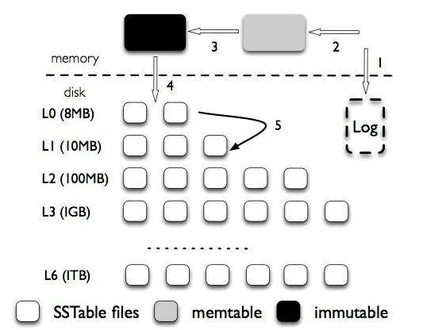

# Project1 LSM Tree
In this project, you will learn the basic architecture of LSM tree and finish the implementation of LevelDB, a representative LSM-tree-based key/value storage engine.

The log-structured merge-tree (also known as LSM tree, or LSMT) is a data structure with performance characteristics that make it attractive for providing indexed access to files with high insert volume, such as transactional log data. LSM trees, like other search trees, maintain key-value pairs. LSM trees maintain data in two or more separate structures, each of which is optimized for its respective underlying storage medium; data is synchronized between the two structures efficiently, in batches.

LSM tree is widely used in mainstream persistent KV storage systems like LevelDB and RocksDB. RocksDB, which is used as TiKV's storage engine, borrows significant code from the open source [Leveldb](https://code.google.com/google/leveldb/) project and does a lot of performance optimization. However, RocksDB has a higher amount of code and is more difficult to learn. As a beginner's course for KV storage, this project is based on LevelDB.

### Architecture


A brief introduction to the architecture of LSM tree is provided later in this article. For more details, you can also read our collection of documents at <https://github.com/iridiumine/USTC_ADSL_KVgroup_docs>.


#### Memtable
`Memtable` is an in-memory component in which the data incoming from client requests is first written, which is basically a skip-list, an ordered data structure. After the skip-list has got enough entries and has hit its threshold memory it is transformed into an immutable Memtable, and then it waits to be flushed to the Disk, sorted in form of `SSTable`.

#### SSTable
`SSTable` or sorted string table as the name explains contains the entry in sorted format on keys on disk. When the sorted data from RAM is flushed to disk it is stored in form of `SSTable`. SSTables are divided into different levels, with lower levels storing newer entries and higher levels storing older entries. The SSTable within each level are ordered(except Level0) and the SSTables between the different levels are disordered. After the memtable has reach its threshold size, it is first flushed to Level0. After a while the entries will be moved to a higher level by `compaction`.

#### Log
`Log` in LevelDB is a write ahead log. As mentioned earlier, entries written by LevelDB is first saved to MemTable. To prevent data loss due to downtime, data is persisted to the log file before being written to MemTable. After Memtable is flushed to the disk, related data can be deleted from the log.

### The Code
In this part, you will finish the implementation of LevelDB, which involves three important operations in LSM tree: Get/Compaction/Scan. It maintains a simple database of key/value pairs. Keys and values are strings. `Get` queries the database and fetches the newest value for a key. There may be multiple versions of the same key in the database because of the append nature of the LSM tree. `Compaction` merges some files into the next layer and does garbage collection. `Scan` fetches the current value for a series of keys.

#### 1. Get
The code you need to implement is in `db/db_impl.cc` and `db/version_set.cc`. 
- Inside `db/db_impl.cc`, you need to complete the function `DBImpl::Get` (Blank1.1), which searches Memtable, immutable Memtable, and SSTable until the key is found and returns the value. 
- Inside `db/version_set.cc`, you need to complete the function `Version::ForEachOverlapping` (Blank1.2) and the function `Version::Get` (Blank1.3).

#### 2. Compaction
In this part, the code you need to implement is in `db/db_impl.cc` and `db/version_set.cc`. 
- Inside `db/db_impl.cc`, you need to complete the function `DBImpl::BackgroundCompaction` (Blank2.1) and the function `DBImpl::InstallCompactionResults` (Blank2.2).
- Inside `db/version_set.cc`, you need to complete the function `VersionSet::Finalize` (Blank2.3) and the function `VersionSet::PickCompaction` (Blank2.4)

#### 3. Scan
In this part, the code you need to implement is in `db/version_set.cc` and `table/merger.cc`.
- Inside `db/version_set.cc`, you need to complete the function `Version::AddIterators` (Blank3.1).
- Inside `table/merger.cc`, you need to complete the function `Seek` (Blank3.2).

### Test

Make:
```bash
mkdir -p build && cd build
cmake -DCMAKE_BUILD_TYPE=Release .. && cmake --build .
```
Please see the CMake documentation and `CMakeLists.txt` for more advanced usage.

Test:
```bash
./db_bench
```
Please see the CMake documentation and `leveldb/benchmarks/db_bench.cc` for more advanced usage.